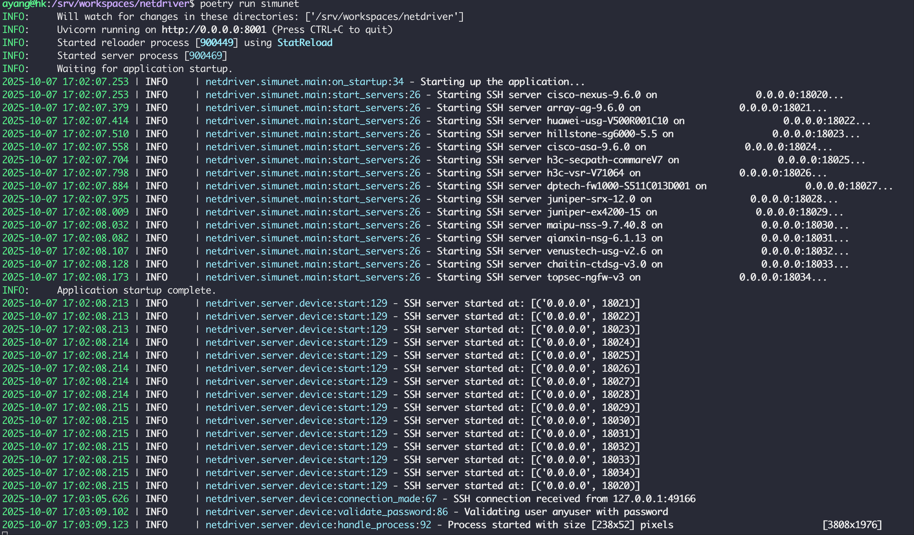

# NetDriver

[](https://www.python.org/)
[](https://python-poetry.org/)
[](./LICENSE)
[]()
[]()
[]()
[](https://github.com/PanMarkCake/netdriver/commits/main)
[](https://github.com/PanMarkCake/REPO/releases/tag/v0.1.0)


# Table of Contents
- [Overview](#overview)
- [Features](#features)
- [Installation](#installation)
- [Usage](#usage)
- [Contributing](#contributing)
- [License](#license)
- [Themes](#themes)

## Overview

NetDriver is a network device automation framework that enables CLI command execution through HTTP RESTful APIs. It simplifies network automation development while enhancing security and reliability.


NetDriver adopts a Monorepo architecture consisting of multiple sub-projects:

- **netdriver-agent** - Provides REST APIs for device connectivity testing and command execution
- **netdriver-simunet** - Simulates network device terminals for automated testing and other scenarios requiring device emulation


## Features

- 🌐 **HTTP RESTful API** : Easy integration with third-party platforms
- 🔄 **Session Management** : Customizable session persistence for improved efficiency, eliminating repeated connections per command
- 📋 **Command Queue** : Ensures sequential command execution on devices, preventing configuration errors and failures caused by concurrent modifications
- ⚡ **AsyncSSH Foundation** : Superior concurrency capabilities through asynchronous SSH implementation
- 🔌 **Plugin Architecture** : Simplified and accelerated development of new vendor support
  

## Project Structure

```
netdriver/
├── bases/ 
│   └── netdriver/
│       ├── agent/          # netdirver-agent app
│       └── simunet/        # netdriver-simunet app 
├── components/
│   └── netdriver/
│       ├── client/         # SSH client with session management 
│       ├── exception/      # Exception handling and error codes
│       ├── log/           # Logging utilities
│       ├── plugin/        # Plugin system core
│       ├── plugins/       # Device-specific plugins
│       ├── server/        # SSH server of simulated devices
│       ├── textfsm/       # Enhanced Textfsm
│       └── utils/         # Utility functions
├── config/                # Configuration files
├── tests/                 # Test suites
└── pyproject.toml        # Project metadata and dependencies
```

## Installation

### Prerequisites

- Python 3.12 or higher
- Poetry for dependency management

## Development Environment Setup

### Python Installation

We recommend using pyenv to manage and install Python.

Install Python build dependencies

```bash
sudo apt update; sudo apt install build-essential libssl-dev zlib1g-dev \
libbz2-dev libreadline-dev libsqlite3-dev curl git \
libncursesw5-dev xz-utils tk-dev libxml2-dev libxmlsec1-dev libffi-dev liblzma-dev
```

Install pyenv

```bash
curl -fsSL https://pyenv.run | bash
```

Configure `~/.bashrc` file by appending the following text to the end

```bash
# Load pyenv automatically by appending
# the following to
# ~/.bash_profile if it exists, otherwise ~/.bashrc (for login shells)
# and ~/.bashrc (for interactive shells) :

export PYENV_ROOT="$HOME/.pyenv"
[[ -d $PYENV_ROOT/bin ]] && export PATH="$PYENV_ROOT/bin:$PATH"
eval "$(pyenv init - bash)"
```

Apply the changes to your current shell session

```bash
source ~/.bashrc
```

Verify pyenv installation

```bash
$ pyenv --version
pyenv 2.6.8
```

> Reference: <https://github.com/pyenv/pyenv/wiki#suggested-build-environment>

Install Python (recommended version: 3.12.7)

```bash
# List available versions
pyenv install --list
# Install Python 3.12.7
pyenv install 3.12.7
# Set as global version
pyenv global 3.12.7
# Verify installation
python --version
Python 3.12.7
```

### Poetry Installation

Poetry is the default build and dependency management tool for this project

```bash
# Install Poetry
curl -sSL https://install.python-poetry.org | python3 -

# Configure ~/.bashrc
echo 'export PATH="$HOME/.local/bin:$PATH"' >> ~/.bashrc
source ~/.bashrc

# Verify installation
poetry --version
Poetry (version 1.8.3)

# Install Poetry plugins
poetry self add poetry-multiproject-plugin
poetry self add poetry-polylith-plugin
```

> References:
> - <https://python-poetry.org/docs/#installing-with-the-official-installer>
> - <https://davidvujic.github.io/python-polylith-docs/>

### Install Development Dependencies

```bash
poetry install
```

## Usage

### Start the Agent Service

```bash
poetry run agent
```

Once the Agent service is started, you can access the FastAPI OpenAPI interface through a web browser to test API calls.

http://localhost:8000/docs


### Start the Simulation Network Service

```bash
poetry run simunet
```

Once the Simunet service is started, you can access the simulated devices through SSH clients or the Agent.




## Configuration

Configuration files are located in the `config/` directory:

- `config/agent/agent.yml` - Agent service configuration
- `config/simunet/simunet.yml` - Simulation network configuration

## Testing

Run all tests:

```bash
poetry run pytest
```

Run unit tests only:

```bash
poetry run pytest -m unit
```

Run integration tests only:

```bash
poetry run pytest -m integration
```

## Contributing

Contributions are welcome! Please feel free to submit a Pull Request.

### Development Guidelines

1. Follow PEP 8 style guidelines
2. Add tests for new features
3. Update documentation as needed
4. Ensure all tests pass before submitting PR

## Support

For questions, issues, or feature requests, please open an issue on the project repository.

# License

This project is licensed under the [Apache License 2.0](LICENSE).

## Themes
asdasdas

## Authors

- vincent@byntra.se
- bobby@byntra.se
- sam@byntra.se
- mark@byntra.se
