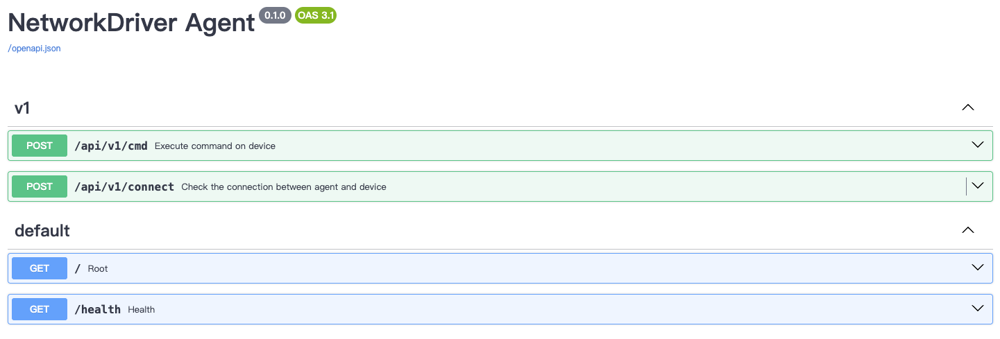

# NetDriver Agent Quick Start Guide

This guide will help you quickly get started with NetDriver Agent service.

## Table of Contents

- [Introduction](#introduction)
- [Installation](#installation)
  - [Prepare](#prepare)
  - [Configuration](#configuration)
  - [Option 1: Install via PyPI](#option-1-install-via-pypi)
  - [Option 2: Install via Docker](#option-2-install-via-docker)
- [Using the REST API](#using-the-rest-api)
- [Next Steps](#next-steps)

## Introduction

NetDriver Agent is a FastAPI-based REST API service that provides:

- **Device Connectivity Testing**: Verify SSH connectivity to network devices
- **Command Execution**: Execute CLI commands on network devices via HTTP API
- **Session Management**: Maintain persistent SSH sessions with customizable timeouts
- **Command Queue**: Ensure sequential command execution to prevent configuration conflicts

### Key Features

- **HTTP RESTful API**: Easy integration with third-party platforms and automation tools
- **Session Persistence**: Reuse SSH connections for improved efficiency and reduced latency
- **Command Queue**: Sequential command execution prevents configuration conflicts
- **Flexible Configuration**: Customize timeouts and behavior per device, vendor, or globally
- **High Performance**: AsyncSSH-based architecture for handling multiple concurrent requests

## Installation

### Prepare

Create and enter a directory for running the agent. Then:

**1. Create Configuration Directory**

```bash
mkdir -p config/agent logs
```

**2. Download Default Configuration File**

```bash
curl -o config/agent/agent.yml https://raw.githubusercontent.com/OpenSecFlow/netdriver/master/config/agent/agent.yml
```

### Configuration

The Agent configuration file is located at `config/agent/agent.yml`:

```yaml
api:
  # HTTP request log level
  # - INFO: only output request method and path
  # - DEBUG: output detailed request body
  request_log_level: DEBUG

logging:
  # Log level: INFO / DEBUG / TRACE
  level: INFO
  # Agent log file path
  log_file: logs/agent.log

session:
  # Session pool check interval (seconds)
  check_interval: 30
  # Read buffer size (bytes), default 1MB
  read_buffer_size: 1048576

  ssh:
    login_timeout: 20        # Login timeout (seconds)
    connect_timeout: 30      # Connection timeout (seconds)
    keepalive_interval: 60   # Keepalive interval (seconds)
    keepalive_count_max: 3   # Max keepalive retry count

  profiles:
    # Global profile, used when no other profile matches
    global:
      read_timeout: 10.0          # Read timeout (seconds)
      expiration_time: "16:00"    # Session expiration time (HH:MM)
      max_idle_time: 600.0        # Max idle time (seconds)

    # Vendor/model/version based profile (higher priority than global)
    vendor:
      cisco:
        nexus:
          base:
            read_timeout: 60.0
            expiration_time: "16:00"
            max_idle_time: 600.0

    # IP address based profile (highest priority)
    # ip:
    #   192.168.1.1:
    #     read_timeout: 15.0
    #     expiration_time: "16:00"
    #     max_idle_time: 600.0
```

> The downloaded sample configuration includes sensible defaults for most use cases. You can customize the settings based on your specific requirements.

#### Configuration Explanation

1. **API Settings**:
   - `request_log_level`: Controls HTTP request logging verbosity (INFO or DEBUG)

2. **Session Timeout Settings**:
   - `read_timeout`: Read timeout during command execution
   - `expiration_time`: Daily session expiration time; all sessions are closed at this time
   - `max_idle_time`: Maximum idle time before automatically closing the session

3. **SSH Connection Settings**:
   - `login_timeout`: Maximum time to wait for login completion
   - `connect_timeout`: Maximum time to wait for SSH connection
   - `keepalive_interval`: Interval between keepalive packets
   - `keepalive_count_max`: Maximum number of keepalive retries

4. **Configuration Priority**: IP config > Vendor config > Global config

5. **Logging Configuration**:
   - `level`: Log level (INFO, DEBUG, TRACE)
   - `log_file`: Path to log file

**Important Notes**:

- Configuration profiles allow device-specific settings
- IP-based profiles have the highest priority
- Vendor/model/version profiles override global settings
- Global profile is used when no specific profile matches

Choose one of the following installation methods:

### Option 1: Install via PyPI

#### Prerequisites

- Python 3.12 or higher
- pip (Python package installer)

#### Installation Steps

**1. Install NetDriver Agent Package**

```bash
pip install netdriver-agent
```

**2. Verify Installation**

```bash
python -c "import netdriver.agent; print('NetDriver Agent installed successfully')"
```

#### Run

```bash
uvicorn netdriver.agent.main:app --host 0.0.0.0 --port 8000
```

### Option 2: Install via Docker

#### Prerequisites

- Docker 20.10 or higher
- Docker Compose (optional)

#### Using Docker Run

```bash
docker run -d \
  --name netdriver-agent \
  -p 8000:8000 \
  -v $(pwd)/config:/app/config \
  -v $(pwd)/logs:/app/logs \
  ghcr.io/opensecflow/netdriver/netdriver-agent:latest
```

validate docker running

```bash
λ › docker ps                                                                                                                                                                                              ~
CONTAINER ID   IMAGE                                                  COMMAND                   CREATED         STATUS                   PORTS                                         NAMES
fb51ab4f1275   ghcr.io/opensecflow/netdriver/netdriver-agent:latest   "uvicorn netdriver.a…"   4 minutes ago   Up 4 minutes (healthy)   0.0.0.0:8000->8000/tcp, [::]:8000->8000/tcp   netdriver-agent
λ ›
```

### Check log

Run `tail` command to check logs

```bash
tail -f logs/agent.log
```

After successful startup, you'll see output similar to:

```text
λ › tail -f logs/agent.log                                                                                                                                             docker-instances/netdriver-agent main
2025-10-31 09:51:12.594 +00:00 | INFO | - | netdriver.plugin.core:__init__:25 | registed plugin: array/base -> <class 'netdriver.plugins.array.array.ArrayBase'>
2025-10-31 09:51:12.595 +00:00 | INFO | - | netdriver.plugin.core:__init__:25 | registed plugin: array/ag -> <class 'netdriver.plugins.array.array_ag.ArrayAG'>
2025-10-31 09:51:12.595 +00:00 | INFO | - | netdriver.plugin.core:__init__:25 | registed plugin: chaitin/base -> <class 'netdriver.plugins.chaitin.chaitin.ChaiTinBase'>
2025-10-31 09:51:12.595 +00:00 | INFO | - | netdriver.plugin.core:__init__:25 | registed plugin: chaitin/ctdsg.* -> <class 'netdriver.plugins.chaitin.chaitin_ctdsg.ChaiTinCTDSG'>
2025-10-31 09:51:12.595 +00:00 | INFO | - | netdriver.plugin.core:__init__:25 | registed plugin: venustech/base -> <class 'netdriver.plugins.venustech.venustech.VenustechBase'>
2025-10-31 09:51:12.596 +00:00 | INFO | - | netdriver.plugin.core:__init__:25 | registed plugin: venustech/usg.* -> <class 'netdriver.plugins.venustech.venustech_usg.VenustechUSG'>
2025-10-31 09:51:12.596 +00:00 | INFO | - | netdriver.plugin.engine:_load_plugins:45 | Loaded 43 plugins.
2025-10-31 09:51:12.596 +00:00 | INFO | - | netdriver.client.pool:__new__:28 | Creating SessionManager instance
2025-10-31 09:51:12.596 +00:00 | INFO | - | uvicorn.lifespan.on:startup:62 | Application startup complete.
2025-10-31 09:51:12.596 +00:00 | INFO | - | uvicorn.server:_log_started_message:214 | Uvicorn running on http://0.0.0.0:8000 (Press CTRL+C to quit)
2025-10-31 09:51:17.448 +00:00 | INFO | 3df1be5d06f5456b80f5cb8a0dec5b1f | uvicorn.protocols.http.h11_impl:send:473 | 127.0.0.1:46318 - "GET /health HTTP/1.1" 200
```

## Using the REST API

The Agent provides an OpenAPI (Swagger) documentation interface for easy API testing and learning:

Visit http://localhost:8000/docs



### Test Connection

You can test connectivity to a real network device or the device simulated by SimNet.

```bash
curl -X 'POST' \
  'http://localhost:8000/api/v1/connect' \
  -H 'accept: application/json' \
  -H 'Content-Type: application/json' \
  -d '{
  "protocol": "ssh",
  "ip": "192.168.60.99",
  "port": 22,
  "username": "admin",
  "password": "admin",
  "enable_password": "",
  "vendor": "paloalto",
  "model": "pa",
  "version": "8.1.0",
  "encode": "utf-8",
  "vsys": "default",
  "timeout": 60
}'
```

> **API Parameters Explained:**
>
> - **API Endpoint**: `http://localhost:8000/api/v1/connect`
> - **protocol**: Currently only supports SSH; Telnet support is planned for future releases.
> - **ip, port, username, password**: Standard connection parameters for network devices.
> - **enable_password**: Required only for devices that prompt for an enable password when switching from login mode to privileged mode (e.g., Cisco ASA, IOS, and Array AG). Leave empty for other devices.
> - **vendor, model, version**: Specifies which plugin to load for the session. Refer to the OpenAPI documentation for supported values.
> - **encode**: Specifies the device's character encoding. NetDriver Agent automatically converts input and output between the device encoding and UTF-8.
> - **vsys**: Set to "default" if the device doesn't support virtual systems. If specified, NetDriver Agent will automatically switch to the designated virtual system before executing commands.
> - **timeout**: Request timeout in seconds.

Got response

```bash
{
  "code": "OK",
  "msg": "Connection is alive"
}
```

> **API Response Explained**
>
> - **code**: "OK" or error code
> - **msg**: detail message of response

### Execute Commands

Execute CLI commands on network devices:

```bash
curl -X 'POST' \
  'http://localhost:8000/api/v1/cmd' \
  -H 'accept: application/json' \
  -H 'Content-Type: application/json' \
  -d '{
  "protocol": "ssh",
  "ip": "192.168.60.99",
  "port": 22,
  "username": "admin",
  "password": "admin",
  "enable_password": "",
  "vendor": "paloalto",
  "model": "pa",
  "version": "8.1.0",
  "encode": "utf-8",
  "vsys": "default",
  "timeout": 60,
  "continue_on_error": true,
  "commands": [
    {
      "type": "raw",
      "mode": "enable",
      "command": "show system info",
      "template": "",
      "detail_output": true
    }
  ]
}'
```

> **API Parameters Explained:**
>
> - **continue_on_error**: If `true`, all commands will be executed ignoring errors; if `false`, execution will stop when an error occurs.
> - **commands**: Supports executing multiple commands in one request
>   - **type**: `raw` returns the raw output; `textfsm` parses the output using a TextFSM template
>   - **mode**: Options are `login`, `enable`, or `config`. The agent will automatically detect the current mode and switch to the specified mode.
>   - **command**: The command to execute on the device. Supports multiple lines using `\n`.
>   - **template**: The template for parsing output; leave empty when using type `raw`.
>   - **detail_output**: If `true`, records output during mode or vsys switching; if `false`, records output only for command execution.

got response

```json
{
  "code": "OK",
  "msg": "",
  "time": 0.08519816398620605,
  "result": [
    {
      "ret_code": "OK",
      "command": "show system info",
      "ret": "\u001b[Kadmin@pa-60.99> show system info\n\nhostname: pa-60.99\nip-address: 192.168.60.99\npublic-ip-address: unknown\nnetmask: 255.255.255.0\ndefault-gateway: 192.168.60.1\nip-assignment: static\nipv6-address: unknown\nipv6-link-local-address: fe80::524d:13ff:fe00:600/64\nipv6-default-gateway: \nmac-address: 50:4d:13:00:06:00\ntime: Fri Oct 31 18:23:30 2025\nuptime: 0 days, 0:28:45\nfamily: vm\nmodel: PA-VM\nserial: unknown\nvm-mac-base: BA:DB:EE:FB:AD:00\nvm-mac-count: 255\nvm-uuid: 6A28E9C6-1288-4A90-89E1-FC1766012B98\nvm-cpuid: KVM:63060000FDFB8B07\nvm-license: none\nvm-mode: KVM\ncloud-mode: non-cloud\nsw-version: 8.1.0\nglobal-protect-client-package-version: 0.0.0\napp-version: 769-4439\napp-release-date: \nav-version: 0\nav-release-date: \nthreat-version: 0\nthreat-release-date: \nwf-private-version: 0\nwf-private-release-date: unknown\nurl-db: paloaltonetworks\nwildfire-version: 0\nwildfire-release-date: \nurl-filtering-version: 0000.00.00.000\nglobal-protect-datafile-version: unknown\nglobal-protect-datafile-release-date: unknown\nglobal-protect-clientless-vpn-version: 0\nglobal-protect-clientless-vpn-release-date: \nlogdb-version: 8.1.8\nplatform-family: vm\nvpn-disable-mode: off\nmulti-vsys: off\noperational-mode: normal\n\nadmin@pa-60.99> "
    }
  ],
  "output": "\u001b[Kadmin@pa-60.99> show system info\n\nhostname: pa-60.99\nip-address: 192.168.60.99\npublic-ip-address: unknown\nnetmask: 255.255.255.0\ndefault-gateway: 192.168.60.1\nip-assignment: static\nipv6-address: unknown\nipv6-link-local-address: fe80::524d:13ff:fe00:600/64\nipv6-default-gateway: \nmac-address: 50:4d:13:00:06:00\ntime: Fri Oct 31 18:23:30 2025\nuptime: 0 days, 0:28:45\nfamily: vm\nmodel: PA-VM\nserial: unknown\nvm-mac-base: BA:DB:EE:FB:AD:00\nvm-mac-count: 255\nvm-uuid: 6A28E9C6-1288-4A90-89E1-FC1766012B98\nvm-cpuid: KVM:63060000FDFB8B07\nvm-license: none\nvm-mode: KVM\ncloud-mode: non-cloud\nsw-version: 8.1.0\nglobal-protect-client-package-version: 0.0.0\napp-version: 769-4439\napp-release-date: \nav-version: 0\nav-release-date: \nthreat-version: 0\nthreat-release-date: \nwf-private-version: 0\nwf-private-release-date: unknown\nurl-db: paloaltonetworks\nwildfire-version: 0\nwildfire-release-date: \nurl-filtering-version: 0000.00.00.000\nglobal-protect-datafile-version: unknown\nglobal-protect-datafile-release-date: unknown\nglobal-protect-clientless-vpn-version: 0\nglobal-protect-clientless-vpn-release-date: \nlogdb-version: 8.1.8\nplatform-family: vm\nvpn-disable-mode: off\nmulti-vsys: off\noperational-mode: normal\n\nadmin@pa-60.99> \n===== end exec cmd: [show system info] 2025-10-31 10:23:30.633140 =====\n"
}
```

> **API Response Explained**
>
> - **time**: Time consumed in seconds for the request.
> - **result**: Result item for each command.
>   - **ret_code**: "OK" or error code for each command execution.
>   - **command**: The command that was executed.
>   - **ret**: The raw CLI output or TextFSM parsed objects.
> - **output**: The CLI output of the request, including the output of all commands.

Check output in pretty way

```text
admin@pa-60.99> show system info

hostname: pa-60.99
ip-address: 192.168.60.99
public-ip-address: unknown
netmask: 255.255.255.0
default-gateway: 192.168.60.1
ip-assignment: static
ipv6-address: unknown
ipv6-link-local-address: fe80::524d:13ff:fe00:600/64
ipv6-default-gateway:
mac-address: 50:4d:13:00:06:00
time: Fri Oct 31 18:23:30 2025
uptime: 0 days, 0:28:45
family: vm
model: PA-VM
serial: unknown
vm-mac-base: BA:DB:EE:FB:AD:00
vm-mac-count: 255
vm-uuid: 6A28E9C6-1288-4A90-89E1-FC1766012B98
vm-cpuid: KVM:63060000FDFB8B07
vm-license: none
vm-mode: KVM
cloud-mode: non-cloud
sw-version: 8.1.0
global-protect-client-package-version: 0.0.0
app-version: 769-4439
app-release-date:
av-version: 0
av-release-date:
threat-version: 0
threat-release-date:
wf-private-version: 0
wf-private-release-date: unknown
url-db: paloaltonetworks
wildfire-version: 0
wildfire-release-date:
url-filtering-version: 0000.00.00.000
global-protect-datafile-version: unknown
global-protect-datafile-release-date: unknown
global-protect-clientless-vpn-version: 0
global-protect-clientless-vpn-release-date:
logdb-version: 8.1.8
platform-family: vm
vpn-disable-mode: off
multi-vsys: off
operational-mode: normal

admin@pa-60.99>
===== end exec cmd: [show system info] 2025-10-31 10:23:30.633140 =====
```

### Execute Commands with TextFSM parsing

Let's use [TextFSM](https://github.com/google/textfsm) to retrive structed data from raw output.

#### TextFSM Template

Folloing template is going to retrive hostname, ip, model, version from outpuot.

```textfsm
Value HOSTNAME (\S+)
Value IP(\d{1,3}\.\d{1,3}\.\d{1,3}\.\d{1,3})
Value MODEL (\S+)
Value VERSION (\S+)

Start
  ^hostname:\s+${HOSTNAME}
  ^ip-address:\s+${IP}
  ^model:\s+${MODEL}
  ^sw-version:\s+${VERSION} -> Record 
```

Request

```bash
curl -X 'POST' \
  'http://localhost:8000/api/v1/cmd' \
  -H 'accept: application/json' \
  -H 'Content-Type: application/json' \
  -d '{
  "protocol": "ssh",
  "ip": "192.168.60.99",
  "port": 22,
  "username": "admin",
  "password": "admin",
  "enable_password": "",
  "vendor": "paloalto",
  "model": "pa",
  "version": "8.1.0",
  "encode": "utf-8",
  "vsys": "default",
  "timeout": 60,
  "continue_on_error": true,
  "commands": [
    {
      "type": "textfsm",
      "mode": "enable",
      "command": "show system info",
      "template": "Value HOSTNAME (\\S+)\nValue IP_ADDRESS (\\d{1,3}\\.\\d{1,3}\\.\\d{1,3}\\.\\d{1,3})\nValue MODEL (\\S+)\nValue VERSION (\\S+)\n\nStart\n  ^hostname:\\s+${HOSTNAME}\n  ^ip-address:\\s+${IP_ADDRESS}\n  ^model:\\s+${MODEL}\n  ^sw-version:\\s+${VERSION} -> Record",
      "detail_output": true
    }
  ]
}'
```

Got response

```json
{
  "code": "OK",
  "msg": "",
  "time": 0.06978988647460938,
  "result": [
    {
      "ret_code": "OK",
      "command": "show system info",
      "ret": [
        {
          "HOSTNAME": "pa-60.99",
          "IP_ADDRESS": "192.168.60.99",
          "MODEL": "PA-VM",
          "VERSION": "8.1.0"
        }
      ]
    }
  ],
  "output": "\u001b[Kadmin@pa-60.99> show system info\n\nhostname: pa-60.99\nip-address: 192.168.60.99\npublic-ip-address: unknown\nnetmask: 255.255.255.0\ndefault-gateway: 192.168.60.1\nip-assignment: static\nipv6-address: unknown\nipv6-link-local-address: fe80::524d:13ff:fe00:600/64\nipv6-default-gateway: \nmac-address: 50:4d:13:00:06:00\ntime: Fri Oct 31 18:59:21 2025\nuptime: 0 days, 1:04:36\nfamily: vm\nmodel: PA-VM\nserial: unknown\nvm-mac-base: BA:DB:EE:FB:AD:00\nvm-mac-count: 255\nvm-uuid: 6A28E9C6-1288-4A90-89E1-FC1766012B98\nvm-cpuid: KVM:63060000FDFB8B07\nvm-license: none\nvm-mode: KVM\ncloud-mode: non-cloud\nsw-version: 8.1.0\nglobal-protect-client-package-version: 0.0.0\napp-version: 769-4439\napp-release-date: \nav-version: 0\nav-release-date: \nthreat-version: 0\nthreat-release-date: \nwf-private-version: 0\nwf-private-release-date: unknown\nurl-db: paloaltonetworks\nwildfire-version: 0\nwildfire-release-date: \nurl-filtering-version: 0000.00.00.000\nglobal-protect-datafile-version: unknown\nglobal-protect-datafile-release-date: unknown\nglobal-protect-clientless-vpn-version: 0\nglobal-protect-clientless-vpn-release-date: \nlogdb-version: 8.1.8\nplatform-family: vm\nvpn-disable-mode: off\nmulti-vsys: off\noperational-mode: normal\n\nadmin@pa-60.99> \n===== end exec cmd: [show system info] 2025-10-31 10:59:22.108917 =====\n"
}
```

Check `ret`, it got a object list parsed by Textfsm.

## Summary

**What You've Accomplished**:

- ✅ Installed and configured NetDriver Agent
- ✅ Started the Agent service (via PyPI or Docker)
- ✅ Connected to network devices via REST API
- ✅ Executed commands and retrieved structured data

**Key Takeaways**:

- NetDriver Agent provides HTTP RESTful API for network device automation
- Session persistence improves efficiency by reusing SSH connections
- Command queue ensures sequential execution to prevent conflicts
- Supports multiple vendors with flexible configuration profiles
- TextFSM integration enables structured data extraction from CLI output

**API Capabilities**:

- `POST /api/v1/connect` - Test device connectivity
- `POST /api/v1/cmd` - Execute commands with raw or TextFSM output
- Automatic mode switching (login/enable/config)
- Virtual system (vsys) support for multi-context devices
- Comprehensive error handling and timeout management

Thank you for using NetDriver Agent! Happy automating!
