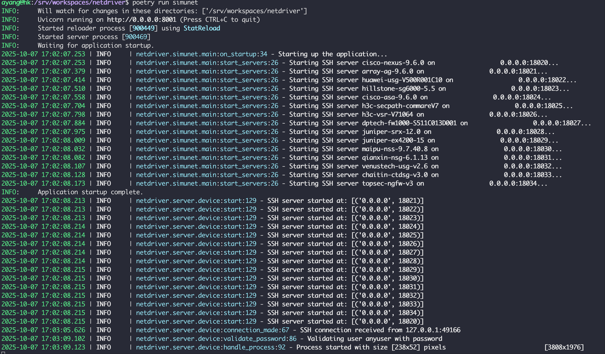
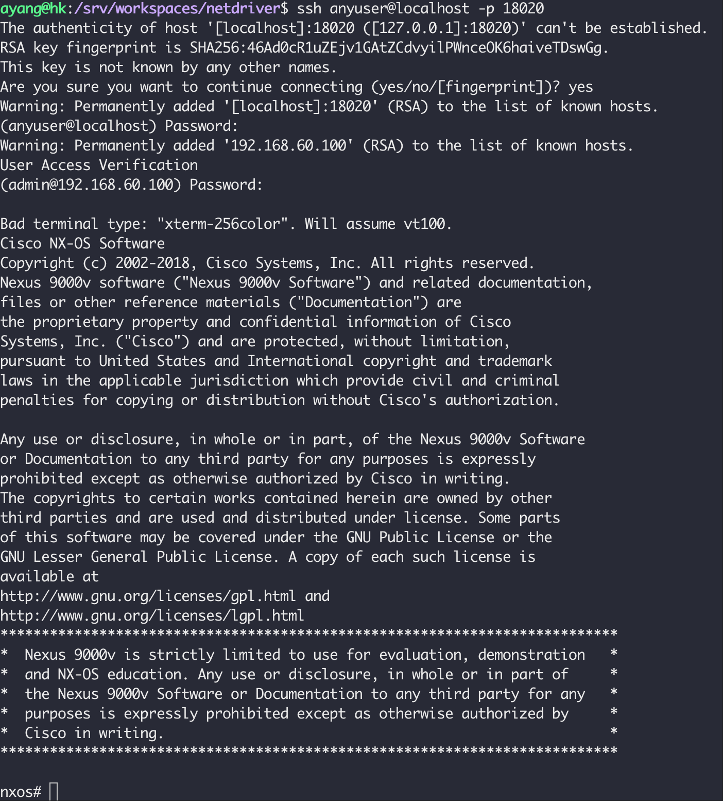

# SimuNet Quick Start Guide

This guide will help you quickly get started with NetDriver SimuNet service.

## Table of Contents

- [Introduction](#introduction)
- [Installation](#installation)
  - [Prepare](#prepare)
  - [Configuration](#configuration)
  - [Option 1: Install via PyPI](#option-1-install-via-pypi)
  - [Option 2: Install via Docker](#option-2-install-via-docker)
- [Connecting to Simulated Devices](#connecting-to-simulated-devices)
- [Next Steps](#next-steps)

## Introduction

SimuNet is a network device simulator that emulates SSH terminal behavior of real network devices. It's designed for:

- **Automated Testing**: Test automation scripts without real hardware
- **Development and Debugging**: Develop and test new plugins safely
- **Demonstrations and Training**: Provide simulated environments for demos

### Key Features

- **Multi-Vendor Support**: Emulates devices from Cisco, Huawei, Juniper, and more
- **Easy Setup**: Simple YAML configuration for device definitions
- **Plugin-Based**: Uses the same plugin system as the Agent
- **Realistic Behavior**: Emulates device prompts, modes, and command responses
- **High Performance**: AsyncSSH-based SSH server for multiple simultaneous connections

## Installation

### Prepare

Create and enter a directory for running simunet. Then:

**1. Create Configuration Directory**

```bash
mkdir -p config/simunet logs
```

**2. Download Default Configuration File**

```bash
curl -o config/simunet/simunet.yml https://raw.githubusercontent.com/OpenSecFlow/netdriver/master/config/simunet/simunet.yml
```

### Configuration

The SimuNet configuration file is located at `config/simunet/simunet.yml`:

```yaml
logging:
  level: INFO
  log_file: logs/simunet.log

devices:
  - vendor: cisco          # Vendor
    model: nexus          # Model
    version: 9.6.0        # Version
    port: 18020           # SSH port

  - vendor: huawei
    model: usg
    version: V500R001C10
    port: 18022

  - vendor: juniper
    model: srx
    version: 12.0
    port: 18028
```

> The downloaded sample configuration includes all device types currently supported by SimuNet. You can remove devices that are not needed.

#### Configuration Explanation

1. **Device Parameters**:
   - `vendor`: Device vendor (must match plugin vendor name)
   - `model`: Device model (must match plugin model name)
   - `version`: Device version (for plugin selection)
   - `port`: SSH port for this simulated device

2. **Logging Configuration**:
   - `level`: Log level (INFO, DEBUG, TRACE)
   - `log_file`: Path to log file

**Important Notes**:

- Each device must have a unique port
- Vendor and model must match an available plugin
- Port range 18020-18100 is recommended to avoid conflicts

Choose one of the following installation methods:

### Option 1: Install via PyPI

#### Prerequisites

- Python 3.12 or higher
- pip (Python package installer)

#### Installation Steps

**1. Install NetDriver SimuNet Package**

```bash
pip install netdriver-simunet
```

**2. Verify Installation**

```bash
python -c "import netdriver.simunet; print('NetDriver Agent installed successfully')"
```

#### Run

```bash
uvicorn netdriver.agent.main:app --host 0.0.0.0 --port 8001
```

### Option 2: Install via Docker

#### Prerequisites

- Docker 20.10 or higher
- Docker Compose (optional)

#### Using Docker Run

```bash
docker run -d \
  --name netdriver-simunet \
  -p 18020-18040:18020-18040 \
  -v $(pwd)/config:/app/config \
  -v $(pwd)/logs:/app/logs \
  ghcr.io/opensecflow/netdriver/netdriver-simunet:latest
```

> Because simunet will listen on a port for a kind of device, So the docker need mapping a range of ports.
> You can also using docker host network mode instead maping a range of ports.

Docker instance run usign host network mode

```bash
docker run -d \
  --name netdriver-simunet \
  --network host \
  -v $(pwd)/config:/app/config \
  -v $(pwd)/logs:/app/logs \
  ghcr.io/opensecflow/netdriver/netdriver-simunet:latest
```

### Check log

Run `tail` command to check logs

```bash
tail -f logs/simunet.log
```



## Connecting to Simulated Devices

### Using SSH Client

You can connect to simulated devices using any SSH client:

```bash
# Connect to Cisco Nexus simulated device
ssh admin@localhost -p 18020
```

> username and passowrd can be any string



After successful connection, you can execute commands as you would on a real device:

## Next Steps

Now that you have SimuNet running, you can set up [NetDriver Agent](./quick-start-agent.md) to connect to SimuNet
